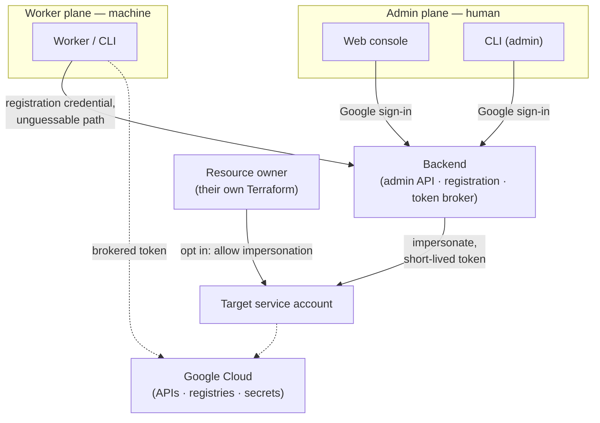

# Workload

An in-house platform for **plug-and-play, GCP-compatible workers**: small,
self-contained jobs that need to touch Google Cloud resources without carrying
any long-lived Google credentials of their own.

A worker should be trivial to hand out and run anywhere. It registers itself, an
admin approves it once, and from then on it can obtain real, short-lived GCP
access on demand — no service-account key files, no `gcloud` login, no
cloud-specific secrets baked into the worker.

## The core idea: brokered impersonation

The heart of the system is a **token broker** running inside our
already-trusted backend. Workers never hold a durable Google credential; they
ask the broker for a short-lived one, and the broker mints it by impersonating a
service account on their behalf.

The unit of access is a **profile**: a named binding to one target service
account, together with the environment (plain and secret) and optional container
image a worker runs under. A worker is granted profiles; it can then claim
against them.

The end-to-end flow:

1. A worker **registers** and waits, presenting a one-time confirmation code.
2. An admin **approves** it and **grants** it one or more profiles.
3. The worker **claims** a profile. The broker checks the grant, then uses its
   own cloud identity to mint a short-lived token that **impersonates that
   profile's target service account**.
4. The worker uses that token to talk to Google Cloud for the few minutes it
   stays valid — then it's gone.

The trust and the blast radius live in one place — the broker and the IAM
bindings behind it — instead of being spread across every worker. Workers stay
dumb and disposable; the sensitive permission stays server-side, scoped per
profile, and short-lived.

## Architecture

The system has **two planes with two different trust models**, a broker that
sits between them and Google Cloud, and an opt-in mechanism that lets any
project make one of its service accounts claimable.

- **Worker plane (machine).** Registration and token claiming. A worker
  authenticates with a credential it earned at registration, and the
  worker-facing API lives behind an unguessable path — it isn't a public,
  discoverable surface. A worker can do nothing until an admin approves it.

- **Admin plane (human).** Managing workers, profiles, and grants. Reached two
  ways over the same API — a web console and the CLI's admin commands — both
  authenticated by an interactive Google sign-in as a real person.

- **The broker** is the only component that holds real GCP power. It mints
  short-lived, profile-scoped tokens by impersonation, and audit-logs
  everything it does.

- **Opt-in impersonation.** A project that wants one of its service accounts to
  be claimable grants the broker permission to impersonate it from **its own
  Terraform**, through a shared module. Ownership of the grant stays with
  whoever owns that service account — Workload never reaches in and takes it.

The CLI is the worker end of "plug-and-play": one install, then it can register,
claim, and run work under a profile — resolving the profile's secrets and
injecting GCP credentials with no `gcloud` on the host. It can also run a
profile's **container image**, pulling it with the brokered credential so a bare
machine with only a container runtime is enough.

## Security model

The design goal is that a leaked worker is boring: it holds nothing durable, and
what it can reach is narrow, granted, and expiring.

- **No long-lived Google credentials on workers.** The only Google credential a
  worker ever sees is a short-lived, impersonated token it just claimed. There
  are no key files and no host sign-in state to steal or to go stale.

- **Centralized, audited trust.** All real GCP power sits in the broker and the
  IAM bindings behind it — one place to reason about, one place that logs. A
  worker's reach is exactly the profiles it was granted, nothing more.

- **Two planes, two credentials, no crossover.** The machine plane (workers) and
  the human plane (admins) authenticate differently on purpose. Admin access
  requires an interactive Google sign-in belonging to the organization's
  Workspace domain; the token's hosted-domain claim is the gate, and **no
  service account can satisfy it** — so no machine identity can reach the admin
  plane, by construction rather than by policy. The console and the admin CLI
  go through the same gate.

- **Explicit, owner-controlled grants.** A service account only becomes
  claimable when its own owner opts in from their Terraform, and a worker only
  reaches a profile when an admin grants it. Both sides are deliberate acts by
  the party who should be making them.

- **Credentials only go to Google.** When the brokered token is used to pull a
  profile's container image, it is only ever sent to Google-hosted registries —
  never to a host named by the image reference — so a profile can't be used to
  exfiltrate a live token to an arbitrary endpoint.

- **What runs can't change underfoot.** A profile's image is pinned to a content
  digest, so a moving tag can't swap out what a worker actually runs between when
  a revision was defined and when it runs.

- **Stated boundaries, not pretended ones.** Some exposures are accepted rather
  than solved: an injected environment (including resolved secrets) is visible
  to anyone with local access to the container runtime, and guaranteed teardown
  is best-effort. These are documented where they live rather than papered over.

## Repository layout

Top-level, by role:

- **`cli/`** — the worker/admin CLI (Kotlin). Two command groups: *worker*
  (register, claim tokens, run work) and *admin* (manage profiles, workers,
  grants).
- **`backend/`** — the service (Kotlin/Armeria on Cloud Run) that hosts the
  worker registration/broker plane and the admin API, with auth and storage
  pluggable so the same core runs in production and locally.
- **`apps/web/`** — the web console (React/Vite SPA), the human-facing front
  door.
- **`proto/`** — the protobuf contract shared by frontend and backend: the
  single source of truth for the admin API.
- **`infra/`** — shared platform infrastructure (Terraform), split by concern
  into separate roots, and the module other projects consume to opt a service
  account in.
- **`worker-mvp/`** — a deliberately throwaway, separately-managed slice of
  infra that exercises the broker flow end to end without touching the real
  backend.

Delivery is automated: CI validates every change and applies/deploys on merge to
trunk, and the CLI is published as a release and a Homebrew formula so a worker
is one install away.

## Status

Internal and experimental. It began life as a full-stack template — some
scaffolding (a leftover counter service) still rides along — and is being grown
toward the worker platform described above. Each component's own `README.md` and
`Taskfile.yml` carry the operational detail and exact commands; this document is
only meant to explain what the system is and how it holds together.
